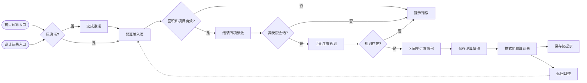
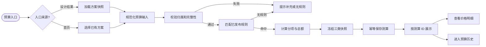

# 设计预算业务逻辑与三端改进分析

> 审计日期：2026-09-08  
> 代码基线：`dc0f411`（`main`）  
> 审计范围：小程序 `前端程序/`、设计域后端 `后端程序/yudao-module-design`、服务端种子数据、管理后台 `管理后台/`  
> 结论口径：以实际代码为准；项目文档只用于识别设计目标与实现偏差。

## 1. 结论摘要

现有“设计预算”不是工程报价系统，而是一个**基于单方造价区间的参考测算 MVP**：服务端按“地区 + 结构 + 材料档次”选择当前生效规则，用建筑面积乘以规则中的最低/最高单方价格，立即落库并返回总价区间。

它已经具备四个正确的基础方向：

1. 预算需要激活账号且服务端再次校验非受限会话；
2. 规则与测算记录分表，测算保存输入快照和规则 ID；
3. 总价以“分”为单位保存，避免常见浮点金额误差；
4. 已有“调价后历史总价不漂移”的 PostgreSQL 合同测试。

但当前实现还不能视为可上线的完整预算业务，核心原因是：

- **创建测算没有校验设计项目归属，也没有校验结果版本与项目的关系**；
- 页面展示的层数、地区、室内装修、方案来源多数是假交互或静态文案，并未参与计价；
- 默认请求组合在开发种子规则中就不存在，默认操作会直接失败；
- “生成预算”时后端已经保存，“保存预算单”按钮却只是成功 Toast；结果只放在进程内全局变量中，重启或直达无法恢复；
- 规则模型只有一个单方区间，没有公司 2026 公式、九项明细、含/不含项和可解释的规则快照；
- 管理后台完全没有预算规则、发布审核、覆盖矩阵、测算查询或异常监控能力；生产规则只能依靠手工 SQL 或其他仓库外操作；
- 最新视觉文档已经改成三页和公司 2026 预算公式，但代码仍是旧的两页区间测算，产品口径与实现口径已经分叉。

综合判断：**当前完成度适合演示“参考区间”的技术闭环，不适合承担真实客户预算决策，更不适合被称为“报价”。**

## 2. 当前实现的业务边界

### 2.1 当前业务定义

代码注释和技术架构把本功能定义为：

- P0 参考区间；
- 不构成正式报价；
- 不进入合同或工程结算；
- 历史测算应当不随新规则漂移。

服务端固定免责声明为“仅供参考，不构成报价或结算依据”。因此，当前正确的领域名应是“预算测算”或“参考估算”，而不是“预算报价”。

### 2.2 实际参与计算的输入

| 输入 | 来源 | 是否进入请求 | 是否进入计算 | 备注 |
| --- | --- | --- | --- | --- |
| `regionCode` | 前端硬编码 `VAR1` | 是 | 是 | UI 虽显示“福建·泉州”，但不能选择 |
| `structureType` | 用户选择 | 是 | 是 | `BRICK/FRAME/STEEL` |
| `materialGrade` | 用户选择 | 是 | 是 | `A/B/C` |
| `buildingArea` | 用户输入 | 是 | 是 | 前端四舍五入为整数，后端限定 1–10000 |
| `resultVersionId` | 小程序全局内存 | 可选 | 否 | 仅尝试关联记录，服务端不校验也不返回 |
| 层数 | 静态显示“2层” | 否 | 否 | 没有交互和字段 |
| 建造地区文案 | 静态显示“福建·泉州” | 否 | 否 | 与 `VAR1` 的语义关系不透明 |
| 包含室内基础装修 | 用户开关 | 否 | 否 | 典型死字段 |
| “方案B” | 静态文案 | 否 | 否 | 并非由当前结果版本推导 |

### 2.3 当前公式

```text
规则键 = regionCode + structureType + materialGrade

totalLowCents  = lowCentsPerSqm  × buildingArea
totalHighCents = highCentsPerSqm × buildingArea
```

规则选择条件为：

```text
effective_at <= 数据库当前时间
AND (expires_at 为空 OR expires_at > 数据库当前时间)
AND deleted = false
ORDER BY effective_at DESC
LIMIT 1
```

除此之外，没有层数、地基、屋面、外装、门窗、专项、室内装修、地区系数、损耗、税费、管理费或分项汇总计算。

## 3. 当前端到端业务流程

可编辑 FigJam 流程图：[现有设计预算业务流程](https://www.figma.com/board/hPQCE1QJQ0uPbIGtSwqKXI?utm_source=other&utm_content=edit_in_figjam&oai_id=v1%2Fw7voVXPono74XZXrklmLs27RwCRta709c6eKHREuKy2AhH0b52ylOX&request_id=6318eede-9c43-4476-8a5d-30fa526671a7)



### 3.1 入口与前端门禁

预算有两个入口：

- 首页卡片：`前端程序/miniprogram/pages/home/index.js:57`；
- AI 设计结果页：`前端程序/miniprogram/pages/ai-design/result.js:48`。

两个入口都会进入 `/pages/budget/input`。预算输入和结果页均被列为受保护业务页，进入页面和点击页面动作时都会检查本地授权快照；未授权用户返回首页并提示激活：`前端程序/miniprogram/utils/access.js:9-15, 99-137`。

这只是体验门禁，真正安全边界仍在服务端。

### 3.2 输入与请求组装

预算输入页：`前端程序/miniprogram/pages/budget/input.js`、`input.wxml`。

1. 页面从 `getApp().globalData.projectId` 获取设计项目 ID；
2. 用户可以修改面积、结构和材料档次；
3. 页面只校验面积大于 0、项目 ID 存在；
4. 面积通过 `Math.round` 转成整数；
5. 请求固定使用 `regionCode: VAR1`；
6. 可选地把全局 `resultVersionId` 转成 JavaScript `Number`；
7. 调用 `POST /app-api/design/v1/design-projects/{projectId}/budget-estimates`。

请求体实际只有：

```json
{
  "regionCode": "VAR1",
  "structureType": "FRAME",
  "materialGrade": "B",
  "buildingArea": 168,
  "resultVersionId": 123
}
```

### 3.3 服务端鉴权与计价

控制器：`后端程序/yudao-module-design/src/main/java/cn/iocoder/yudao/module/design/controller/app/AppBudgetController.java`。

1. 控制器从 `Authorization` 提取 Bearer Token；
2. `identitySessionPort.requireUnrestricted(token)` 要求非受限会话；
3. Bean Validation 只校验三个字符串非空、面积 1–10000；
4. `BudgetService` 查询匹配的当前规则；
5. 无规则时返回业务错误 `1071000002`；
6. 有规则时计算上下限并保存测算。

注意：这里没有调用 `DesignProjectService.getProject(projectId, userId)` 或 `requireOwner`，也没有校验 `resultVersionId`。

### 3.4 持久化

迁移文件：`后端程序/yudao-module-design/src/main/resources/db/migration/design/V20260905.206__p7b_budget_message_privacy.sql`。

`budget_rule_version` 保存：

- 地区、结构、材料档；
- 单方最低/最高价；
- 生效和失效时间；
- 通用审计字段和软删除标记。

`budget_estimate` 保存：

- 项目 ID、用户 ID、规则 ID、可选结果版本 ID；
- 四项输入快照 JSON；
- 总价上下限；
- 免责声明和通用审计字段。

当前两张表之间，以及预算与设计项目、结果版本之间，都没有数据库外键或等效关系约束。

### 3.5 返回与结果展示

服务端返回：测算 ID、项目 ID、规则 ID 字符串、输入快照、总价区间、免责声明、时间。`breakdown` 虽然存在于响应 VO，但服务从未设置，因此始终为 `null`。

前端把整个响应写入 `getApp().globalData.budgetEstimate`，然后无参数跳转结果页。结果页：

- 将“分”转换为“万元区间”；
- 再用总价除以面积，反算并展示单方造价；
- 渲染面积、结构、材料档；
- `breakdown` 为空时隐藏费用构成；
- 点击“保存预算单”只显示成功 Toast，没有任何 API；
- 点击“调整参数”返回上一页。

后端虽然提供预算列表和预算详情接口，但小程序 `api.js` 只封装了创建接口，列表和详情没有被前端使用。

## 4. 数据与状态方法论

### 4.1 建议的领域公式

预算系统应遵循一个可审计的确定性模型：

```text
Estimate = f(
  NormalizedInputSnapshot,
  ImmutableRuleSnapshot,
  CalculationEngineVersion
)
```

任何历史结果都必须能够回答：

1. 当时用户和设计方案提供了什么输入；
2. 哪些输入来自方案、哪些由用户覆盖、哪些是系统推导；
3. 使用了哪一版地区价格、费用项目和系数；
4. 使用了哪一版计算引擎和舍入规则；
5. 得到了哪些分项和总价；
6. 当时的含项、不含项、免责声明和有效范围是什么。

只保存规则 ID 和最终总价还不够；它只能做到“历史展示不变”，不能天然保证“历史可复算”。

### 4.2 输入分层

建议把输入分成四类，并给每个字段保存 `value + source + overridden`：

- **方案事实**：建筑面积、层数、结构等，由设计结果版本带入；
- **用户选择**：建造地区、用材/建造标准、特殊需求；
- **规则推导**：区域价格、损耗、系数、适用条件；
- **系统派生**：工程量、分项小计、合计、展示取整。

原则是：页面上每个看起来会影响价格的字段，必须真的参与计算；不参与的字段必须明确标注“仅展示，不参与本次测算”。

### 4.3 规则生命周期

建议规则生命周期为：

```text
DRAFT → VALIDATING → REVIEWED → PUBLISHED → EFFECTIVE → EXPIRED/WITHDRAWN
```

约束：

- 已发布版本不可修改，只能新建下一版本；
- 同一适用键的生效时间窗不能重叠；
- 发布前必须跑样例回归、边界测试和价格波动检查；
- 发布需要双人复核，并记录差异、原因、审批人和时间；
- 回滚不是修改历史版本，而是发布新的纠偏版本；
- 客户历史测算永远引用当时被冻结的规则快照。

### 4.4 分项计算方法

仓库只说明目标是“公司 2026 预算公式”和“九项明细”，没有公式原表、九项名称、工程量口径、系数和舍入规则。因此不能从现有代码可靠还原真实公司公式。

建议先把公司公式转成一份经过业务签字的规则字典。每个分项至少定义：

- 分项编码和名称；
- 适用条件；
- 工程量来源；
- 单价或区间；
- 系数和固定调整；
- 含项与不含项；
- 舍入规则；
- 生效范围；
- 对外是否展示计算过程。

通用计算骨架可以是：

```text
分项金额 = 工程量 × 单价 × 系数 + 固定调整
总预算   = Σ 分项金额 + 明确定义的附加项
```

这只是承载公式的技术骨架，具体九项和系数必须来自公司预算负责人，不能由研发猜测。

### 4.5 “测算”与“报价”必须分域

当前免责声明明确说“不构成报价”，最新视觉文档却使用“预算报价结果”。这会同时造成用户认知和合规风险。

建议二选一：

- 若仍是快速参考：统一叫“参考预算/预算测算”，不出现“报价”；
- 若要形成正式报价：新建独立报价域，增加客户、项目地址、有效期、税费、审批、报价单版本、合同转换和作废流程，不应直接扩展当前 `budget_estimate`。

## 5. 问题清单

### 5.1 P0：必须先修的正确性与安全问题

#### P0-1 创建预算缺少项目归属校验

证据：`AppBudgetController.java:46-49` 取得用户 ID 后直接调用 `BudgetService.createEstimate`；`BudgetService.java:48-71` 不查询 `design_project`。

影响：已激活用户只要构造项目 ID，就可以在任意真实或不存在的项目 ID 下创建属于自己的预算记录，污染项目数据和后续统计。现有测试 `BudgetMessageP7BContractTest.java:87-93` 在没有插入设计项目的情况下使用项目 100/101 创建预算，反向证明服务没有关系校验。

建议：创建前通过设计项目领域服务验证项目存在、未删除、状态允许且归当前用户；不要只依赖前端全局变量。

#### P0-2 结果版本关联未校验

证据：`resultVersionId` 从请求直接写入 `budget_estimate`；没有查询 `design_result_version`，数据库也没有外键。

影响：可以关联不存在的版本、别人的版本或另一个项目的版本；所谓“从设计方案带入”的审计链不可信。

建议：在同一事务内验证 `result_version.id = ? AND project_id = ?`；明确是否允许给已被取代的历史版本做预算，并把关联 ID 返回给客户端。

#### P0-3 默认操作在开发种子数据上必然无规则

证据：前端默认 `FRAME + B`；`DevDataSeeder.java:64-65` 只创建 `VAR1 + BRICK + A/B`。

影响：用户直接点击“生成参考预算”会得到“暂无生效预算规则”；`FRAME`、`STEEL` 和 `C` 档均无法在种子环境测算。

建议：增加“可用预算选项/规则覆盖矩阵”接口，由服务端告诉前端哪些组合可选；禁用无规则组合。开发种子覆盖所有展示组合，生产规则从管理端发布。

#### P0-4 页面展示与真实计价不一致

证据：层数、地区、“方案B”为静态文案；`interior` 只更新本地状态；请求只发送四项。

影响：用户有理由认为这些选择影响价格，实际没有，结果容易被误解为更精确的估算。

建议：删除无效交互，或把它们完整纳入输入快照和规则引擎；方案带入必须由 `resultVersionId` 对应的服务端快照返回，不能写死。

### 5.2 P1：上线前应完成的业务闭环问题

#### P1-1 “保存”是假动作，状态语义相反

创建接口已经立即写数据库，但结果页“保存预算单”不请求服务端，只 Toast 成功。

建议选择一种明确语义：

- 创建即保存：去掉“保存”，改成“查看明细/分享/联系顾问”；或
- 先预览后保存：提供无副作用预览接口，再用带幂等键的创建接口保存。

#### P1-2 结果依赖全局内存，无法恢复

`budgetEstimate` 只存在 `App.globalData`。小程序重启、页面直达、进程回收后无法查看刚才结果；已有 GET 列表/详情接口没有客户端封装。

建议：创建成功跳转 `/pages/budget/result?estimateId=...`，结果页始终按 ID GET；“我的预算”使用分页列表；全局内存最多作为短期缓存。

#### P1-3 公式模型与最新产品目标不一致

技术架构 `03-众墅之家设计小程序后端技术架构-V1.0.md:461-465` 要求费用构成；最新效果图清单 `00-页面效果图生成清单.md:8, 23-28` 要求公司 2026 公式、三页和九项明细。当前代码只有两页和单方区间。

建议：在继续做 UI 前先冻结公司的计算口径和分项字典，否则管理端、后端和页面会再次返工。

#### P1-4 版本化只完成一半

优点是总价和输入已落库，所以历史展示不会随新规则变化。但：

- 规则没有业务版本号，响应中的 `ruleVersion` 实际只是 Snowflake ID；
- 发布后的规则仍可被 SQL 修改或软删除；
- 测算没有保存完整规则快照、引擎版本和计算哈希；
- `get/list` 不读取表里的免责声明，而是返回当前代码常量；
- 响应不返回 `resultVersionId`；
- 没有任何重算入口。

建议：冻结 `ruleSnapshot + engineVersion + formulaHash + disclaimerSnapshot`，并提供“按原版本校验重算”和“按最新版本新建测算”两个不同动作。

#### P1-5 创建接口无幂等

前端只用 `creating` 防止当前页面重复点击；网络重试、超时重发、跨页面点击仍会重复落库。

建议：要求 `Idempotency-Key`，数据库建立用户维度唯一约束，重复请求返回原测算。

#### P1-6 输入和 API 契约不严谨

- `structureType/materialGrade/regionCode` 只校验非空，不校验枚举或规则字典；
- 面积被强制为整数，农村自建房面积可能需要小数；
- 请求中的 `resultVersionId` 是 JSON 数字，前端还显式 `Number(...)`，Snowflake ID 可能超过 JavaScript 安全整数；
- 响应字段名是 `totalMinCents`，Swagger 描述却写“元”；
- `breakdown` 使用 `List<Map<String,Object>>`，没有稳定类型；
- 列表无分页，排序依赖 ID 而不是明确的创建时间；
- 单价没有服务层上限，乘法缺少溢出保护。

建议：ID 全链路用字符串；金额和面积用明确精度的 Decimal/BigDecimal；使用枚举/字典校验和 typed VO；修正单位合同并加分页。

#### P1-7 生效规则可能冲突且选择不确定

数据库只校验最高价不低于最低价，没有唯一键或时间窗排斥约束。相同键可以有多个重叠规则；若 `effective_at` 相同，`ORDER BY effective_at DESC LIMIT 1` 的选择不稳定。

建议：发布时锁定适用键，拒绝重叠时间窗；查询增加确定性版本序；规则发布必须事务化。

### 5.3 P2：可维护性、体验和可观测性问题

- `BudgetService` 每次 JSON 序列化和每行反序列化都新建 `ObjectMapper`；应注入统一配置实例；
- 原始 `JdbcTemplate + Map` 让预算规则快速扩展九项时类型安全很弱；建议引入明确的领域对象和 Repository；
- 服务没有统一事务包住归属校验、规则选择、计算和保存；
- 没有预算创建、无规则命中、价格异常、规则版本分布等指标和审计事件；
- 前端按钮没有可见加载状态，错误只用短暂 Toast，没有字段级校验或无规则引导；
- 当前页面反算并展示“参考单方造价”，与最新文档“计算方法不对外”存在冲突；
- 前端没有预算业务测试，只有页面注册和激活门禁测试；后端只有一个规则漂移/无规则合同场景，没有控制器鉴权、越权、版本关联、幂等、边界与并发测试；管理端没有预算代码，自然也没有测试。

## 6. 管理后台现状与问题

管理端 API 文件 `管理后台/src/api/zs/index.ts` 覆盖工作台、案例、投稿、授权码、充值、点数、用户、AI 任务、导出和审计，没有预算 API。

管理端路由 `管理后台/src/router/modules/zs.ts` 也没有预算规则或预算记录菜单。后端 `controller/admin` 只有案例、工作台、导出审计和投稿控制器，没有预算管理控制器。

这意味着：

- 生产环境无法通过受控界面创建或发布规则；
- 没有地区 × 结构 × 档次的覆盖矩阵；
- 无法预演新规则对样例房型和历史分布的影响；
- 无双人复核、差异对比、发布时间和回滚机制；
- 客服无法查询客户预算记录和关联方案；
- 运营无法看到成功率、无规则率、价格分布和异常波动；
- 价格规则的权限、保密和审计没有落地。

开发种子也不能替代管理端：正式 profile 默认关闭种子；而开发种子是否整体跳过仅检查 `recharge_plan` 是否已有数据，充值计划存在但预算规则缺失时，预算种子仍会被跳过。

## 7. 推荐目标架构

### 7.1 核心对象

建议至少形成以下对象：

| 对象 | 责任 |
| --- | --- |
| `budget_rule_set` | 业务版本、状态、生效范围、审批和发布时间 |
| `budget_rule_item` | 九项或实际分项、单价、系数、公式引用、适用条件 |
| `budget_rule_snapshot` | 发布时不可变的完整规则 JSON、哈希、引擎版本 |
| `budget_estimate` | 用户、项目、结果版本、规则快照、状态、总价、幂等键 |
| `budget_estimate_input` | 规范化输入及每项来源/覆盖信息 |
| `budget_estimate_item` | 分项编码、名称、工程量、对外金额、显示顺序 |
| `budget_rule_test_case` | 发布前的金样用例、期望区间和回归结果 |

如果公式必须保密，可把内部计算过程与 C 端展示快照分开保存和授权；C 端只得到允许公开的总额、分项金额、含/不含项。

### 7.2 推荐业务流程



首页预算入口目前与“必须先有项目”冲突。建议业务明确选择：

1. **设计派生预算**：首页进入后先选择“我的方案”或引导完成设计；或
2. **独立快速预算**：允许没有设计项目的独立测算，模型中 `projectId/resultVersionId` 可空，输入全部由用户填写。

不要继续维持“首页可直接进入、生成时才提示先设计”的半成品路径。

## 8. 分阶段改进方案

### 阶段 A：先止血，保证数据可信

1. 创建前校验项目所有权、状态和结果版本关系；
2. ID 全链路改为字符串，禁止前端 `Number` 转 Snowflake ID；
3. 增加幂等键和数据库唯一约束；
4. 服务端返回 `resultVersionId`，读取记录中的免责声明；
5. 修正 Swagger 金额单位，补充明确枚举校验；
6. 前端删除或禁用所有未参与计算的字段；
7. 增加规则可用选项接口，避免显示无规则组合；
8. 补越权、跨项目版本、重复请求、边界金额和默认路径测试。

### 阶段 B：建立真正的预算领域

1. 由预算负责人提供并签字确认公司 2026 公式和九项字典；
2. 建立版本化规则集、分项规则和不可变发布快照；
3. 引入计算引擎版本、统一 Decimal 精度与舍入规范；
4. 输出总价、分项、含项、不含项、免责声明和可选置信信息；
5. 建立金样测试和规则回归测试；
6. 明确“按原规则校核”和“按新规则重新测算”的语义。

### 阶段 C：补齐小程序闭环

1. 参数由结果版本真实带入并标注来源，允许的覆盖项由后端下发；
2. 使用 `estimateId` 路由和详情 API，支持刷新、重启、分享和历史查看；
3. 按最新设计实现“信息填写 → 结果 → 分项明细”三页；
4. 统一“测算”术语，去掉与免责声明冲突的“报价”；
5. 处理加载、空态、无规则、过期规则和输入错误；
6. 增加关键漏斗与失败原因埋点。

### 阶段 D：补齐管理端治理

1. 规则草稿、复制版本、差异对比、校验、双人审批、定时发布和撤回；
2. 地区 × 结构 × 标准 × 其他维度覆盖矩阵；
3. 样例房型模拟器和新旧版本价格影响报告；
4. 规则发布审计、权限隔离和敏感公式字段权限；
5. 测算记录查询、关联方案查看、客服备注与合规导出；
6. 无规则率、成功率、价格分布、版本命中率和异常波动监控。

## 9. 建议验收标准

上线前至少满足：

- 任意用户不能给别人的项目或不匹配的结果版本创建预算；
- 同一幂等键无论重试多少次只产生一条测算；
- 同一输入快照 + 规则快照 + 引擎版本得到完全相同结果；
- 新规则发布后，历史测算的总价、分项、含/不含项和免责声明全部不变；
- 所有前端可选组合都有生效规则，或在选择前被明确禁用；
- 页面每个“影响价格”的字段都能追踪到计算项；
- 结果页面刷新、直达、小程序重启后仍可按 ID 恢复；
- 规则未经校验和审批不能发布，已发布规则不能原地修改；
- C 端不返回被定义为保密的公式与内部系数；
- 越权、边界、无规则、版本冲突、幂等、并发和历史不漂移均有自动化测试。

## 10. 关键代码索引

- 小程序输入：`前端程序/miniprogram/pages/budget/input.js`、`input.wxml`
- 小程序结果：`前端程序/miniprogram/pages/budget/result.js`、`result.wxml`
- 小程序 API：`前端程序/miniprogram/utils/api.js:121-125`
- 前端授权门禁：`前端程序/miniprogram/utils/access.js:9-15, 99-137`
- App 全局状态：`前端程序/miniprogram/app.js:5-10`
- 预算控制器：`后端程序/yudao-module-design/src/main/java/cn/iocoder/yudao/module/design/controller/app/AppBudgetController.java`
- 预算服务：`后端程序/yudao-module-design/src/main/java/cn/iocoder/yudao/module/design/budget/BudgetService.java`
- 请求/响应 VO：`AppBudgetEstimateCreateReqVO.java`、`AppBudgetEstimateRespVO.java`
- 预算表迁移：`后端程序/yudao-module-design/src/main/resources/db/migration/design/V20260905.206__p7b_budget_message_privacy.sql`
- 预算合同测试：`后端程序/yudao-module-design/src/test/java/cn/iocoder/yudao/module/design/BudgetMessageP7BContractTest.java`
- 开发种子：`后端程序/yudao-server/src/main/java/cn/iocoder/yudao/server/dev/DevDataSeeder.java:47-68`
- 管理端 API：`管理后台/src/api/zs/index.ts`
- 管理端路由：`管理后台/src/router/modules/zs.ts`

## 11. 审计说明

本次进行了全仓关键词检索、预算前后端逐文件阅读、设计项目/结果版本关系核对、预算数据库迁移与合同测试核对、管理端 API/路由/控制器盘点，并与最新项目文档交叉比对。

当前运行环境没有可用的 `npm` 和 `mvn` 命令，管理端也没有安装 `node_modules`，因此本次没有实际执行前端测试、后端编译或 Testcontainers 合同测试。文中的实现结论来自当前源码静态分析；已有测试覆盖情况来自测试源码本身，不等同于本次动态验证结果。
